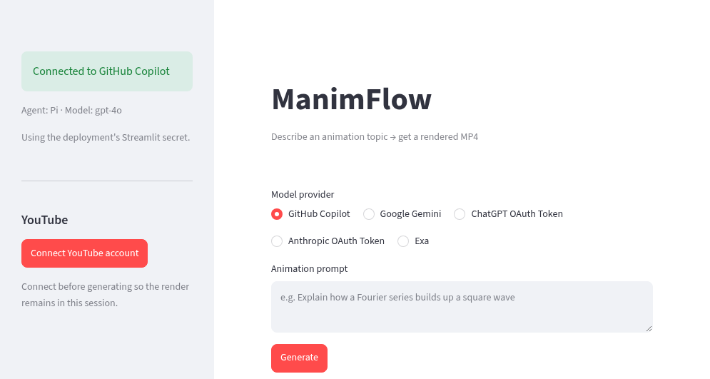

# ManimFlow

ManimFlow turns a natural-language animation request into a rendered Manim video. The Streamlit app plans scenes, gives Pi an isolated project workspace, streams the agent's progress, renders the animation, and keeps repairing failures until it produces an MP4.



[Open ManimFlow](https://manimflow.streamlit.app/)

## What it does

1. Accepts a short topic or a detailed animation brief.
2. Uses the selected model to create a complete scene plan.
3. Starts Pi as an autonomous coding agent in a temporary workspace.
4. Generates modular Manim source files and shows them in a live, read-only Monaco browser.
5. Runs Manim, observes errors, edits the project, and retries until a valid MP4 is available.
6. Displays the video for playback and download.
7. Suggests editable YouTube metadata and can upload the result after browser-based YouTube authorization.

Long and detailed prompts receive longer scene plans. Mathematical and scientific animations use the installed LaTeX toolchain through `MathTex` and `Tex`.

## Model providers

The Streamlit interface currently supports:

| Provider | Authentication | Default model |
| --- | --- | --- |
| GitHub Copilot | Deployment secret or GitHub device login | `gpt-4o` |
| Google Gemini | `GEMINI_API_KEY` in Streamlit Secrets | `gemini-2.5-flash` |
| ChatGPT Codex | Pasted short-lived ChatGPT OAuth access token | `gpt-5.4` |
| Anthropic | Pasted short-lived Anthropic OAuth access token | `claude-haiku-4-5` |
| Exa | Public Exa endpoint through a custom Pi provider | `google/gemini-2.5-flash` |

Pasted OAuth access tokens remain in the active Streamlit session. ManimFlow does not write them to project files or repository configuration.

## Main features

- Autonomous Pi coding and repair loop
- Live, filtered tool and render progress
- VS Code-style read-only Monaco file explorer
- Per-render isolated workspaces
- Full local Manim documentation checkout for providers using the documentation gate
- LaTeX, common TeX packages, recommended fonts, and `dvisvgm`
- MP4 playback and download
- Browser-persistent encrypted YouTube authorization
- LLM-suggested YouTube title, description, and tags
- Resumable YouTube uploads with editable privacy settings
- Serialized render queue for safe concurrent Streamlit sessions
- Isolated Node 22 and pinned Pi `0.80.6` runtime installation when required

## How it works

```text
Animation prompt
      |
      v
Scene planner
      |
      v
plan.md and AGENTS.md
      |
      v
Pi coding agent
      |
      +--> reads local Manim documentation when required
      +--> writes Python modules
      +--> runs Manim
      +--> diagnoses and repairs failures
      |
      v
animation.mp4
      |
      +--> browser playback and download
      +--> optional YouTube upload
```

The app parses Pi's JSON event stream into useful progress messages. Large command and documentation results are shortened only in the frontend log. Files and tool results passed to Pi remain complete.

## Run locally

### Requirements

- Python 3.11 or newer
- Node.js 22 or newer
- The system packages listed in `packages.txt`

Install the application dependencies:

```bash
python -m venv .venv
source .venv/bin/activate
pip install -r requirements.txt
npm ci
```

Copy the example secrets file and add the providers you intend to use:

```bash
cp .streamlit/secrets.toml.example .streamlit/secrets.toml
```

Start Streamlit:

```bash
streamlit run streamlit_app.py
```

## Deploy on Streamlit Community Cloud

1. Fork this repository.
2. Create a Streamlit app with `streamlit_app.py` as the entry point.
3. Add the required values under App settings, then Secrets.
4. Deploy the app. Streamlit installs Python dependencies from `requirements.txt` and system packages from `packages.txt`.

Example secrets:

```toml
COPILOT_TOKEN = "optional-copilot-token"
GEMINI_API_KEY = "optional-gemini-key"

YOUTUBE_CLIENT_ID = "your-client-id.apps.googleusercontent.com"
YOUTUBE_CLIENT_SECRET = "your-client-secret"
YOUTUBE_REDIRECT_URI = "https://your-app.streamlit.app/"
YOUTUBE_TOKEN_ENCRYPTION_KEY = "a-long-random-secret"
```

`COPILOT_TOKEN` is optional because the app can use GitHub device login. `GEMINI_API_KEY` is required only when Google Gemini is selected. The four YouTube values are required only for YouTube uploads.

For YouTube OAuth, enable YouTube Data API v3, create a Google OAuth Web application, and register the exact deployed Streamlit URL as its redirect URI. The app encrypts OAuth credentials before storing them in that browser's local storage.

## Repository layout

| Path | Purpose |
| --- | --- |
| `streamlit_app.py` | Main Streamlit product and render orchestration |
| `pi_extensions/exa_direct.ts` | Direct Exa provider with cleaned output and native Pi tool-call translation |
| `code_browser_component/` | Read-only Monaco code browser |
| `browser_storage_component/` | Browser-local encrypted credential storage bridge |
| `requirements.txt` | Python dependencies |
| `packages.txt` | Streamlit system packages, Manim libraries, FFmpeg, and TeX |
| `package.json` | Pinned Pi coding-agent dependency and Node requirement |

## Miscellaneous

The repository contains earlier interfaces that are no longer the primary product:

### GitHub Actions renderer

`.github/workflows/render.yml` renders an issue after the repository owner applies the `manim` label. It runs the same six-attempt autonomous Pi pipeline with GitHub Copilot and `claude-sonnet-4.5`, then publishes the resulting MP4 as a workflow artifact.

### Colab notebook

`ManimFlow.ipynb` provides an interactive Exa-only Colab workflow. It installs the pinned Pi runtime and uses the same hardened Exa provider extension and autonomous render loop as the Streamlit app.

[Open the Colab notebook](https://colab.research.google.com/github/theabbie/ManimFlow/blob/main/ManimFlow.ipynb)

### Colab CLI

The `manimflow` script launches the Exa and Pi pipeline in a temporary Colab session, streams useful progress, and downloads the rendered MP4. It requires `colab-cli` and an authenticated Colab session.

```bash
pip install colab-cli
colab login
./manimflow "doppler effect visualization"
```

### YouTube upload notebook

`youtube_script.ipynb` is the original standalone YouTube upload experiment. Its functionality is now integrated into the Streamlit app.
